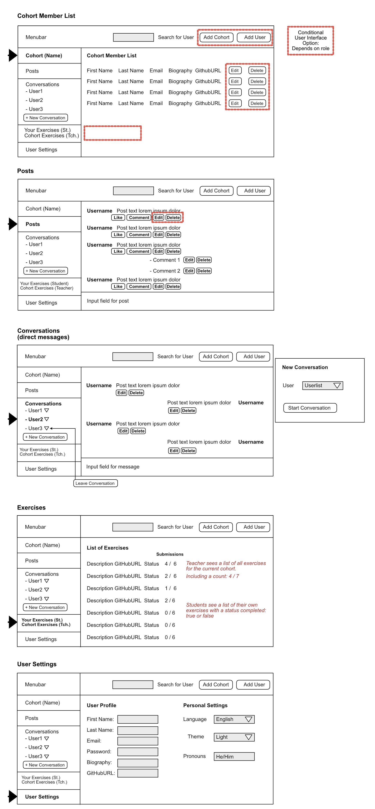

# Concept for Implementation

High-Level View of Requirements

The Cohort Manager is the place for collaboration and messaging between teachers and students who are part of a course and a cohort within the course.

There are two user roles: **teachers** and **students.** They are members of a **course.** Within a course they are members of a **cohort.**

Both roles can log into the Cohort Manager and will be presented with different views presenting them with the functionalities available to them.

## Teachers

Teachers manage/teach multiple cohorts. They can switch context between cohorts and are presented with the **view for each cohort.**

Teachers have two buttons at the top in the **menu bar** with which they can **create a new cohort,** **create a new teacher and student user**. They can **assign users to one or more course and cohort** (details to be determined).

### Teacher View: Cohort List

Teachers can see **all members of any cohort.** Teachers can **edit the data of any student and teacher user.**

### Teacher View: Posts

Teachers can **see the list of posts in their cohort.** They can see the **username** and the **post message text.**
Teachers can **create posts for a cohort.** They can **like and remove their like a post.** They can **delete posts by any other member of a cohort.**

### Teacher View: Conversations

In the **conversation view,** teachers can **send direct messages** to individual single users (teacher and student).

### Teacher View: Exercises

Teachers see a list of all exercises for the cohort including a count showing the number of completed exercises and the total per exercise and overall for all exercises.

### Teacher View: User Settings

Teachers can **edit their own user data**.
They can adjust personal settings e.g. language, theme, personal pronoun.

### Teacher View: Student User Notes

Teachers can **leave notes about students**.
Any teacher can leave a note about any given student, and any teacher can update (add) to that note.

## Students

Students participate in one or more **courses/cohorts.**

### Student View: Cohort List

Students can **see all members of a cohort** they are part of.
Students **cannot** create cohorts or add users.

### Student View: Posts

Students can **see the list of posts in their cohort.** They can see the **username** and the **post message text.**
Students can **create posts for a cohort.** They can **like and  remove their like in a post.** They can **delete posts their own posts.**

### Student View: Conversations

In the conversation view, students can **send direct messages** to individual single users (teacher and student).

### Student View: Exercises

Students see a list of all of **their** exercises and the status completed true/false.

### Student View: User Settings

Students can **edit their own user data** (and cannot edit any user data).
They can adjust persona settings e.g. language, theme, personal pronoun.

## UI Views

